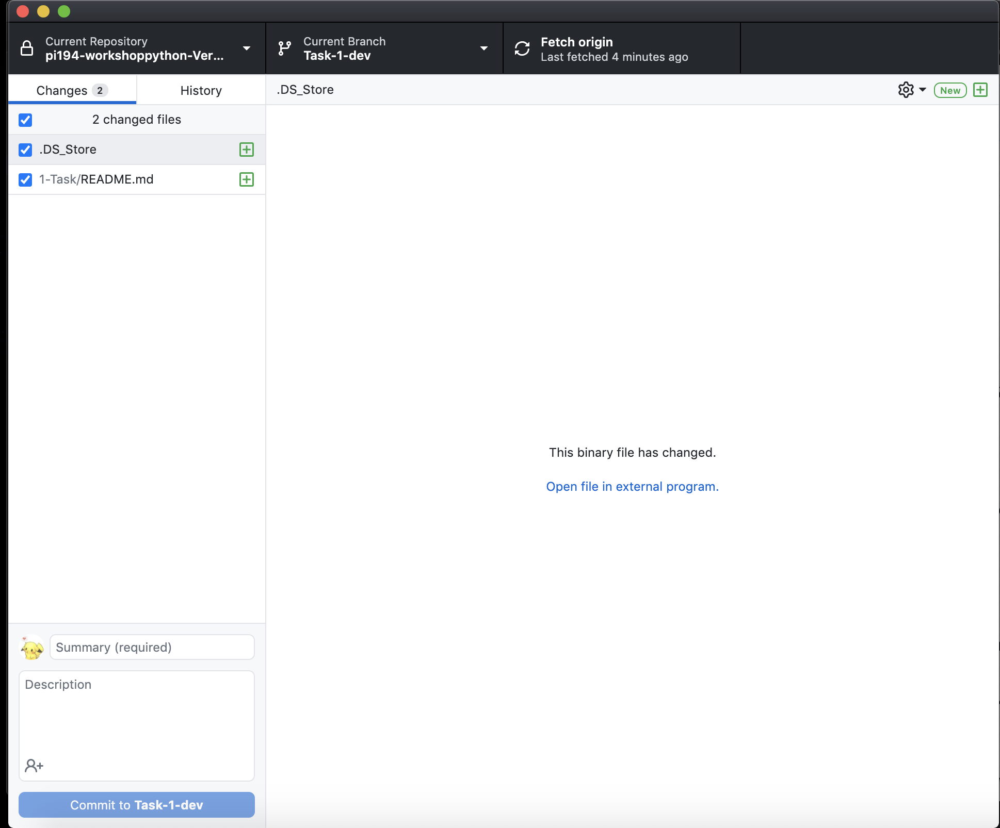
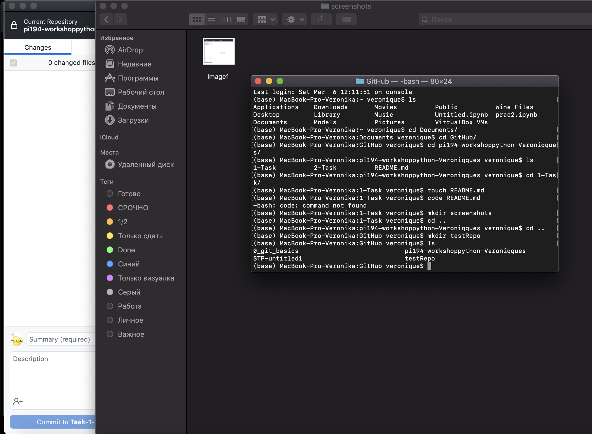
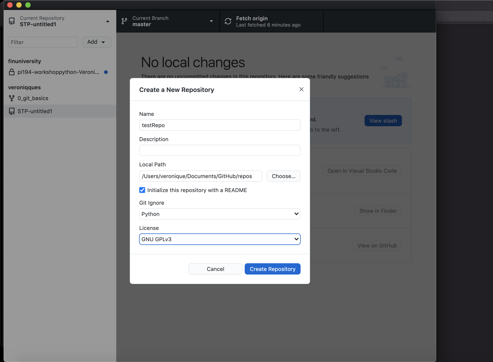
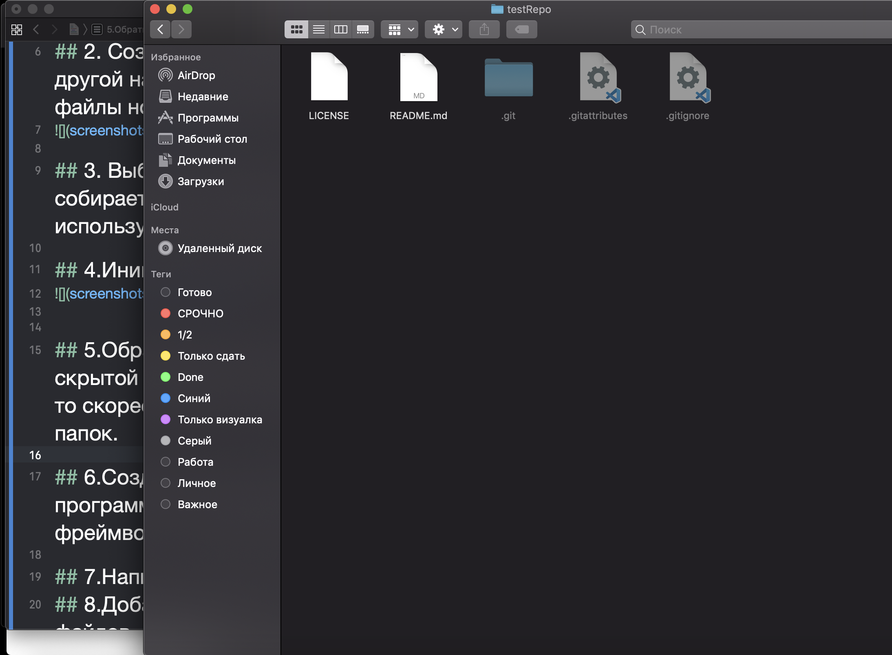
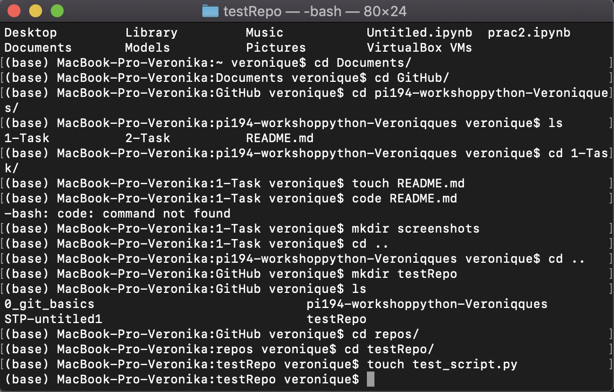
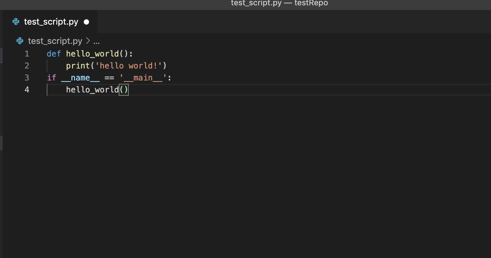
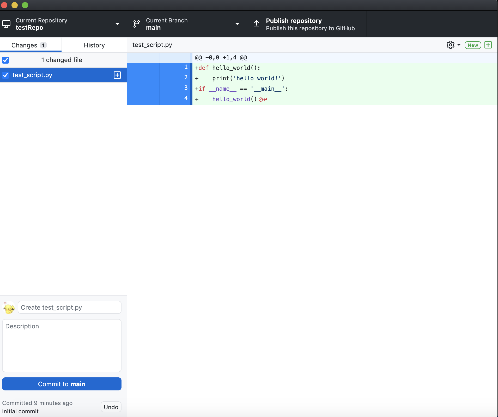
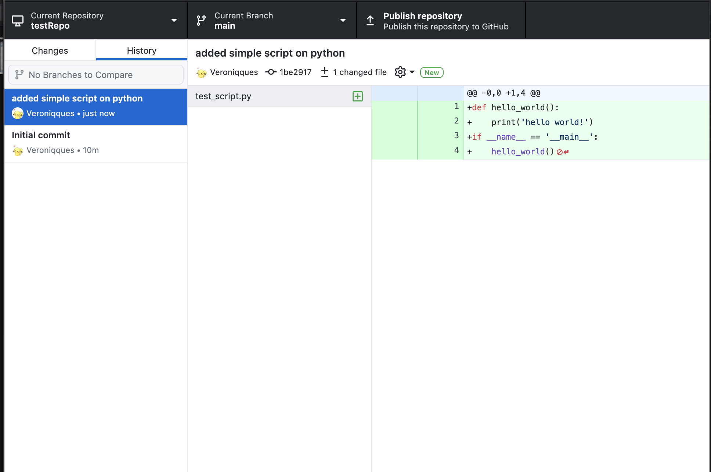
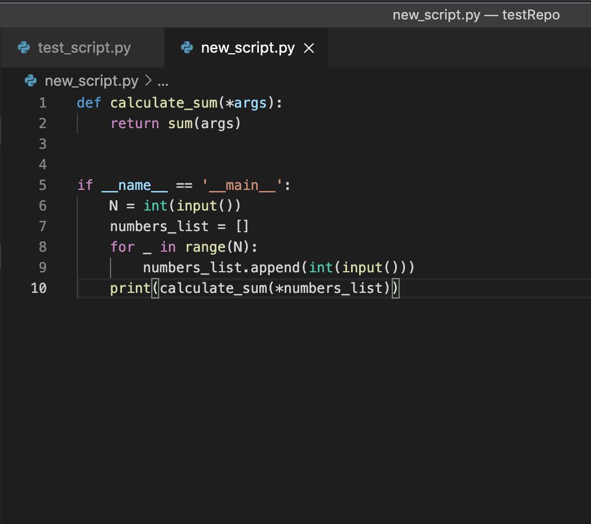
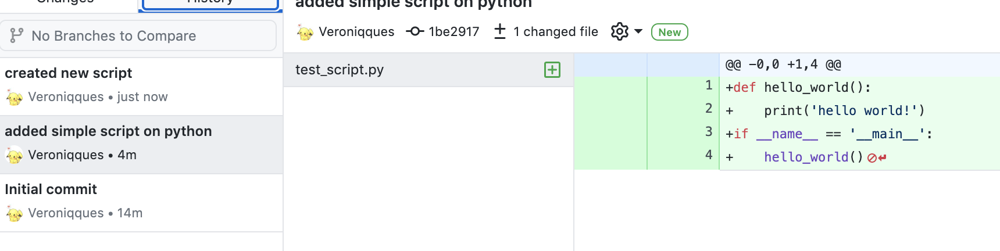

# Отчет по практике №1

## 1. Установить на компьютер графический клиент Git.

## 2. Создайте в своей домашней папке (или в любой другой на ваш выбор) каталог, который будет содержать файлы нового программного проекта.

## 3. Выберите тематику программы, которую собираетесь написать. Язык программирования и используемые инструменты разработки сейчас не важны.

## 4.Инициализируйте в этой директории репозиторий гит.

## 5.Обратите внимание на появление в этой папке скрытой подпапки с названием .git. Если вы ее не видите, то скорее всего, у вас отключено отображение скрытых папок.

## 6.Создайте новый файл для исходного текста программы. Если вы используете программный фреймворк, инициализируйте его в рабочий каталог.

## 7.Напишите несколько строк вашей программы.

## 8.Добавьте файл с исходным текстом (несколько файлов, если необходимо) в индекс вашего репозитория.

## 9.Совершите ваш первый коммит. Напишите осмысленное сообщение коммита.

## 10.Повторите несколько раз. Каждый раз, завершая определенный этап работы, выполняйте коммит и описывайте проделанные изменения в сообщении коммита.

## 11.Просмотрите историю коммитов. Попробуйте перейти на один из прошлых коммитов. Вернитесь в актуальное состояние программы.

