<!----- Conversion time: 1.115 seconds.

Using this Markdown file:

1. Cut and paste this output into your source file.
2. See the notes and action items below regarding this conversion run.
3. Check the rendered output (headings, lists, code blocks, tables) for proper
   formatting and use a linkchecker before you publish this page.

Conversion notes:

* Docs to Markdown version 1.0β17
* Wed Sep 18 2019 01:01:48 GMT-0700 (PDT)
* Source doc: https://docs.google.com/open?id=1sIorEva0JHPGjUlZBihoiGIootksj8HqQUjW8Vota0c
----->

## 1. Основы работы с СКВ в графическом режиме

### Цель работы

Познакомиться на практике с основными приемами работы в современных системах контроля версий.

### Задания для выполнения

1. Установить на компьютер графический клиент Git.

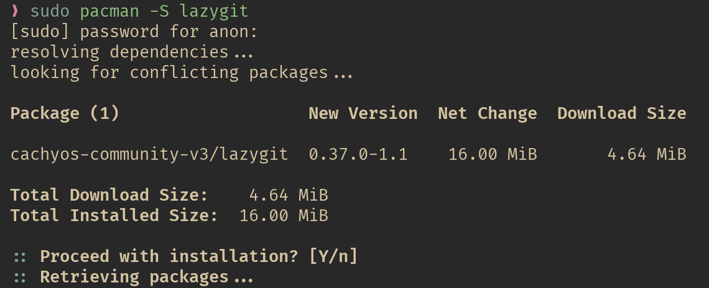

2. Создайте в своей домашней папке (или в любой другой на ваш выбор) каталог, который будет содержать файлы нового программного проекта.

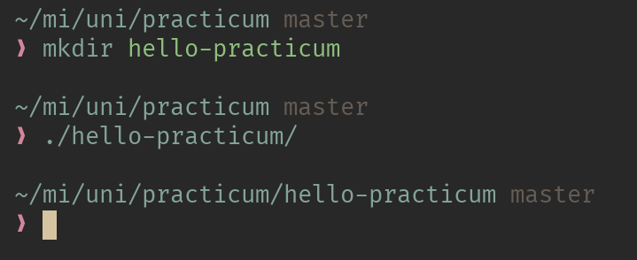

3. Выберите тематику программы, которую собираетесь написать. Язык программирования и используемые инструменты разработки сейчас не важны.
4. Инициализируйте в этой директории репозиторий гит.

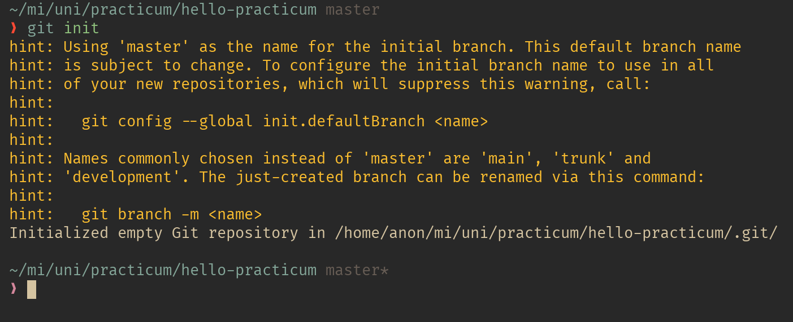

5. Обратите внимание на появление в этой папке скрытой подпапки с названием .git. Если вы ее не видите, то скорее всего, у вас отключено отображение скрытых папок.

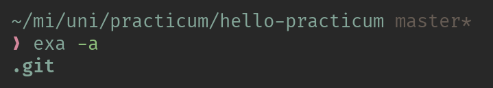

6. Создайте новый файл для исходного текста программы. Если вы используете программный фреймворк, инициализируйте его в рабочий каталог.

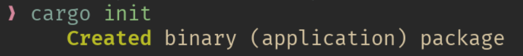

7. Напишите несколько строк вашей программы.

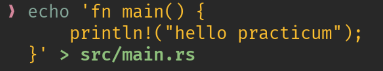

8. Добавьте файл с исходным текстом (несколько файлов, если необходимо) в индекс вашего репозитория. 

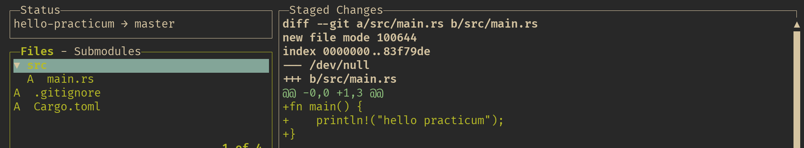

9. Совершите ваш первый коммит. Напишите осмысленное сообщение коммита.

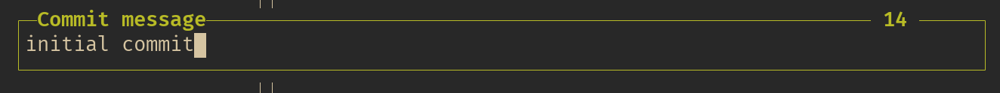

10. Повторите несколько раз. Каждый раз, завершая определенный этап работы, выполняйте коммит и описывайте проделанные изменения в сообщении коммита.

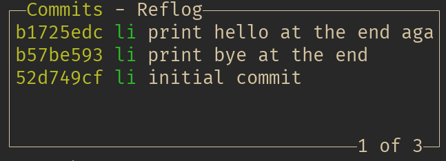

11. Просмотрите историю коммитов. Попробуйте перейти на один из прошлых коммитов. Вернитесь в актуальное состояние программы.

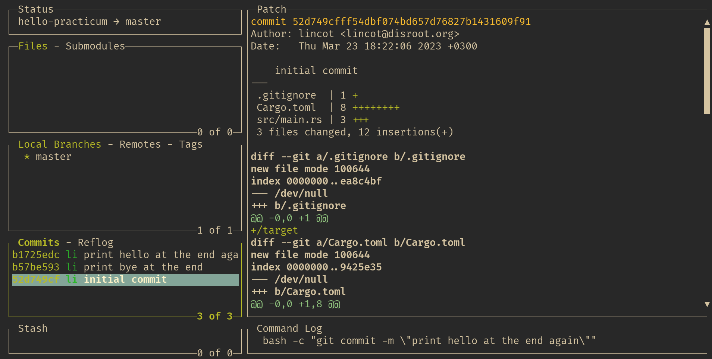

### Методические указания

Для выполнения лабораторной работы необходимо воспользоваться любым консольным клиентом системы контроля версий Git, подходящую для рабочей операционной системы. Для Windows подойдет, например, дистрибутив [git-scm](https://git-scm.com/). Этот же пакет включает в себя и консольную утилиту git, необходимую для выполнения следующих работ. Для Linux существует, например, пакет [Git Cola](https://git-cola.github.io/). 

Для написания сообщений коммита необходимо придерживаться следующего общепринятого правила: в первой строке сообщения следует кратко описать произведенные изменения; если необходимо подробное описание, состоящее из многих строк, то его приводят, отступив от первой строки одну пустую. Помните, что заголовок описания коммита - это то, что будете видеть вы и ваши коллеги в истории изменений проекта. 

### Контрольные вопросы

1. Опишите своими словами значение следующих терминов:
    1. рабочий каталог - папка с кодом или чем-то другим
    2. репозиторий - место хранения данных
    3. коммит - зафиксированная версия проекта и сам процесс фиксации
    4. ветка - последовательность коммитов
2. Ознакомьтесь с гайдом по выбранной  вами программе-клиенту Git.
    <https://github.com/jesseduffield/lazygit/wiki>

### Дополнительные задания

1. Представьте, что вы начинаете большой раздел работы. Для изоляции изменений создайте новую ветку. Назовите ее, чтобы было понятно, что вы в ней будете делать. 

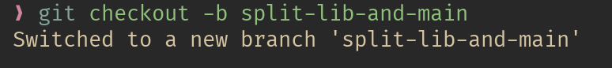

2. Перейдите в новую ветку и сделайте несколько коммитов.

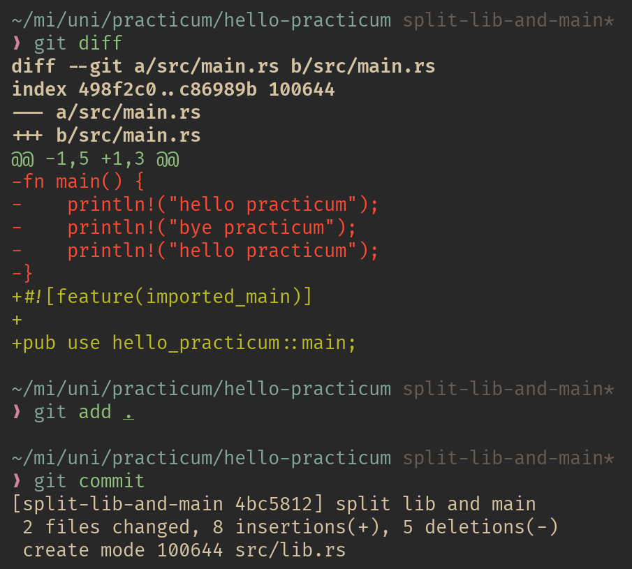

3. Перейдите в основную ветку и обратите внимание на состояние рабочей директории. 

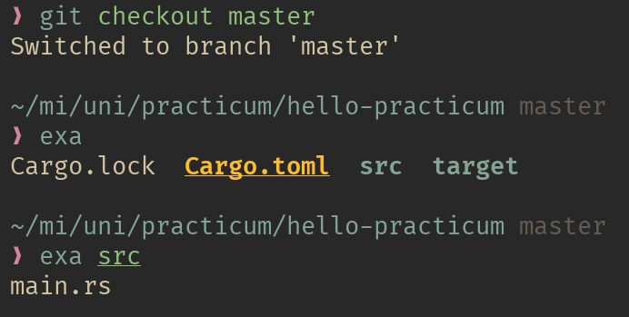

4. Создайте еще одну ветку для работы над другим направлением в вашей программе. Обычно так работают в команде, каждый участник в собственной ветке. Либо в ветках может идти параллельная работа над разными возможностями программы. В таком случае эти ветки называются тематическими.

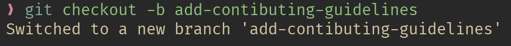

5. Сделайте несколько коммитов во вновь созданную ветку.

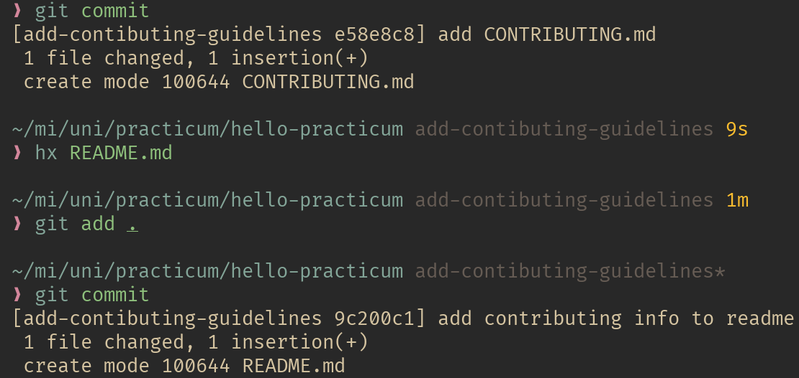

6. Перейдите в основную ветку и слейте в нее первую тематическую ветку.

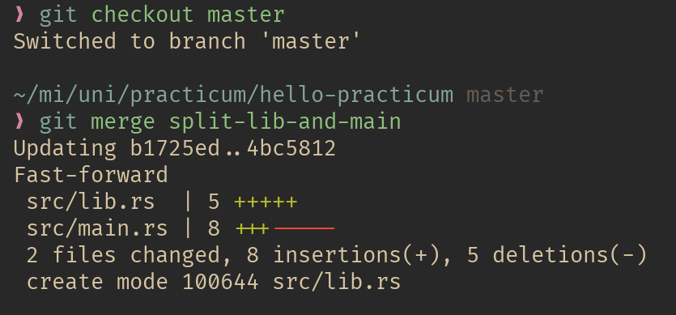

7. Слейте в основную ветку вторую тематическую. Если возникли конфликты слияния, разрешите их и завершите слияние. 

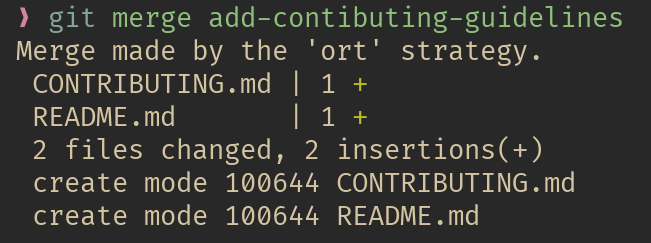

8. Удалите более не нужные тематические ветки. Обратите внимание в истории, что даже при удалении веток никакие коммиты не теряются.

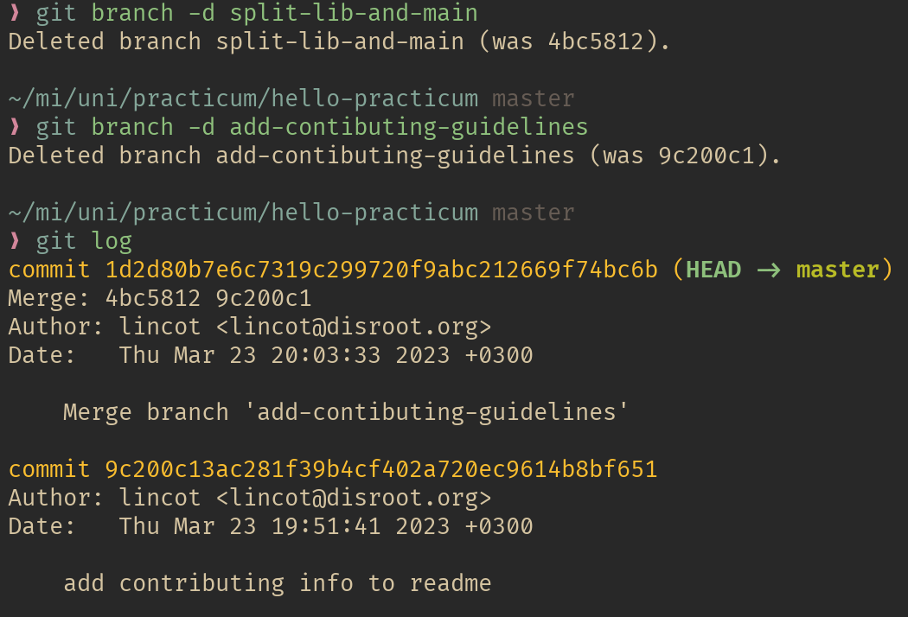

## 2. Работа с Git в терминале

### Цель работы

На основе уже полученных знаний о принципах работы СКВ получить более глубокое представление о работе Git  при помощи команд терминала.

### Задания для выполнения

1. Выберите тематику программы, которую собираетесь написать. Создайте для нее рабочую директорию
2. Инициализируйте в рабочей директории репозиторий при помощи команды git init.
3. Выполните в репозитории команду git status. Проинтерпретируйте полученное сообщение.
4. Создайте файл для исходного текста программы. Выполните команду git status.
5. Добавьте созданный файл под версионный контроль при помощи команды git add. Еще раз выполните git status.
6. Сделайте начальный коммит при помощи команды git commit с опцией -m.
7. Сделайте еще несколько коммитов. Выполните команду git log для просмотра истории коммитов.
8. Сделайте так, чтобы при коммите измененные файлы автоматически добавлялись в коммит.
9. Добавьте еще несколько файлов с исходным текстом программы. 
10.  Добавьте все новые файлы под версионный контроль одной командой. 
11. На всех стадиях работы пользуйтесь командой git status.
12. Инициализируйте в рабочей директории виртуальное окружение (Если вы пишите не на Python, то можете инициализировать какой-либо программный фреймворк, либо начать работать в IDE, которая создает скрытую папку с настройками в рабочем каталоге).
13. Добавьте созданную служебную папку в файл .gitignore. Проверьте, что они не добавляются в репозитории при добавлении новых файлов с исходным кодом. 
14. Создайте новую тематическую ветку git branch. Перейдите в нее с помощью git checkout. Выведите на экран список всех веток.
15. Сделайте несколько коммитов в основную и тематическую ветки. 
16. Слейте изменения в основную ветку с помощью git merge. Если произошел конфликт слияния, разрешите его и завершите слияние с помощью git commit.
17. При получении в процессе разработки программы в стабильно работающем состоянии, слейте это состояние в основную ветку и добавьте к коммиту слияния пометку с номером релиза.

### Методические указания

Для работы в терминале изучите шпаргалки по основным командам git.

Главные команды, которые вам понадобятся это:

git init - создает репозиторий системы контроля версий в данной директории;

git add - добавляет указанный файл под версионный контроль;

git add . - добавляет все файлы текущей директории под версионный контроль;

git status - показывает состояние рабочей директории по сравнению с последним сохраненным состоянием:

git commit -m "(message)" - сохраняет текущее состояние рабочей директории как новое состояние (создает новый коммит); новый коммит получает сообщение, переданное как параметр;

git commit -am "(message)" - создает новый коммит и автоматически включает в него все изменившиеся отслеживаемые файлы;

git log - выводит историю коммитов репозитория;

git branch - показывает список веток репозитория;

git branch <branchname> - создает новую ветку на основе текущего состояния с переданным названием;

git checkout -b <branchname> - создает новую ветку и автоматически делает ее текущей;

git merge <branchname> - сливает изменения, сделанные в ветке с переданным названием в текущую;

git branch -d <branchname> - удаляет ветку с переданным названием;

git clone (repo URL) - клонирует удаленный репозиторий, находящийся по переданному адресу в текущую директорию; доступ обычно осуществляется по протоколам HTTP либо SSH;

git fetch - считывает изменения в удаленном репозитории, отсутствующие в локальной копии;

git pull - считывает новые изменения в удаленном репозитории и сливает их в соответствующие локальные ветки;

git push –all - отправляет изменения, сделанные в локальном репозитории в удаленный;

### Контрольные вопросы

1. Что такое удаленный репозиторий?
2. Где нужно вводить команды git?
3. Для чего нужны ветки в системах контроля веток?
4. Как возникают конфликты слияни
5. Как разрешать конфликты слияния?

### Дополнительные задания

1. Ознакомьтесь с методологией разработки GitFlow.
2. Установите на свой компьютер инструментальное средство для работы с GitFlow.
3. Выполните основные задания лабораторной работы с использованием команд git-flow.

## 3. Работа с удаленными репозиториями и GitHub

### Цель работы

Освоить основные навыки работы с облачными и распределенными системами контроля версий, получить навыки работы с инструментальными средствами, обеспечивающими командную работу над разработкой ПО.

### Задания для выполнения

1. Зарегистрироваться на сайте github.com
2. Установить на компьютере программу Git
3. Форкнуть данный репозиторий в свой аккаунт
4. Склонировать созданный удаленный репозиторий в директорию ~/git/test

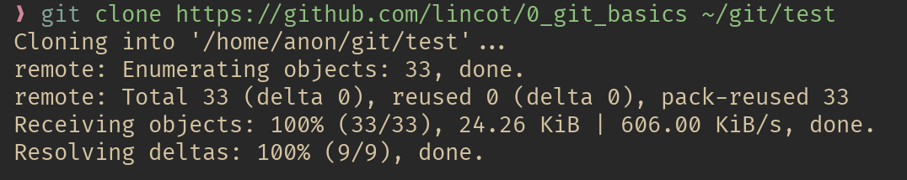

5. На локальной машине пишем скрипт ~/git/test/backup.sh, с произвольным содержанием

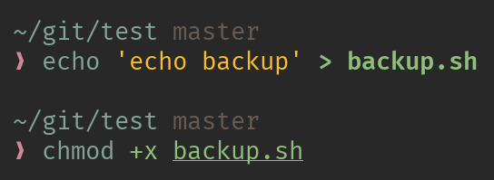

6. Фиксируем скрипт в репозитории (делаем коммит)

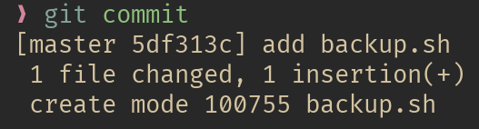

7. Обновляем удаленный репозиторий репозиторий (делаем пуш)

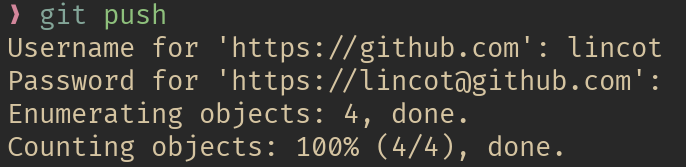

8. Через текстовый редактор добавить любую новую строку с комментарием

9. Сделать коммит

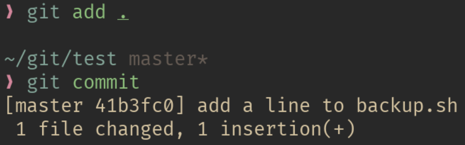

10. Вности синтаксическую ошибку в скрипт

11. Сделать коммит ошибочного скрипта

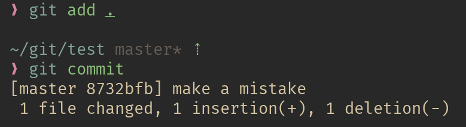

12. Откатываем до последней рабочей версии

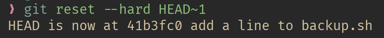

13. Просмотреть историю коммитов

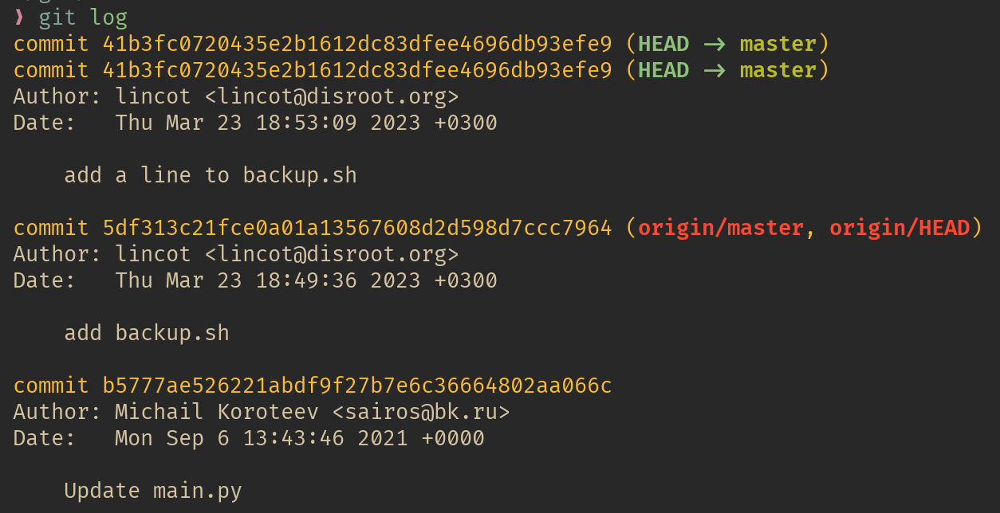

14. Добавить несколько коммитов произвольного содержимого
15. Создать пулл реквест в данный репозиторий

### Контрольные вопросы

1. Зачем нужен облачный хостинг репозиториев?
    чтобы с лёгкостью делиться и работать вместе над кодом и другими файлами
2. Какими основными функциями обладает сайт github.com?
    гит хостинг, баг трекинг (issues), пулл реквесты, непрерывная интеграция, вики
3. Как организовать командную работу над открытым проектом?
    захостить репозиторий, настроить права доступа, ревьюить патчи и всё такое

### Дополнительные задания

1. Дополнительно оценивается, если студент продемонстрирует работу с ветками в процессе написания более-сложного программного проекта (не менее трех файлов, двух веток, десяти коммитов, как минимум одно объединение).
2. Дополнительно оценивается демонстрация командной работы. Для этого нужно склонировать репозиторий другому члену команды и коммитить от своего имени. При отправке истории на удаленный сервер (push) на сайте будет отображаться общая история. При скачивании истории с сервера (pull) общая история будет отображаться на локальном компьютере.
3. Настройте работу с git вашей интегрированной среды разработки по выбору. Для работы с python рекомендуется использовать PyCharm. Выполните задания лабораторной работы в IDE используя встроенные средства работы с системами контроля версий.

<!-- Docs to Markdown version 1.0β17 -->
